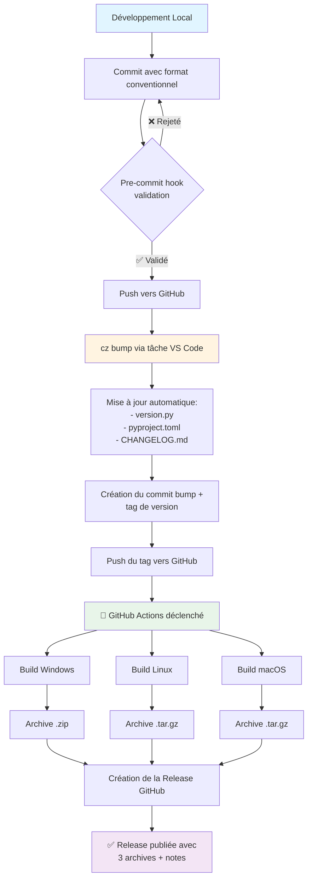

# Release Process - Multi-OS

## Overview

Ce document décrit le processus complet de création d'une release pour
Writing Assistant Pro. Le système génère automatiquement des exécutables
pour Windows, Linux et macOS à chaque tag de version.

## 🔄 Flux de Release Complet



## 📋 Processus Étape par Étape

### 1. Développement Local

#### a) Faire vos modifications

- Développez vos nouvelles fonctionnalités
- Testez localement avec `run_dev` et `build_dev`

> ⚠️ **Important :** Le dossier `dist/` est dans `.gitignore` et ne sera
> jamais poussé vers GitHub.

#### b) Créer un commit conventionnel

Utilisez le format Conventional Commits (voir section suivante).

#### c) Push vers GitHub

```powershell
git push origin main
```

### 2. Création d'une Release

#### a) Lancer la tâche de bump

1. Ouvrir Command Palette : `Ctrl+Shift+P`
2. Sélectionner : `Tasks: Run Task`
3. Choisir : `Commitizen: Bump Version`

#### b) Ce qui se passe automatiquement

1. **Analyse des commits** depuis la dernière version
2. **Calcul de la nouvelle version** selon les types de commits :
   - `feat:` → MINOR (1.0.0 → 1.1.0)
   - `fix:` → PATCH (1.0.0 → 1.0.1)
   - `BREAKING CHANGE:` → MAJOR (1.0.0 → 2.0.0)
3. **Mise à jour des fichiers** :
   - `src/version.py`
   - `pyproject.toml`
   - `CHANGELOG.md`
4. **Création du commit** : `bump: version X.Y.Z → A.B.C`
5. **Création du tag** : `vA.B.C` (ex: `v1.1.0`)
6. **Push automatique** du tag (si configuré avec `--push`)

### 2bis. Création d'une Pré-Release (Beta)

Pour créer une version beta (tests avant release finale) :

#### a) Lancer la tâche de pré-release

1. Ouvrir Command Palette : `Ctrl+Shift+P`
2. Sélectionner : `Tasks: Run Task`
3. Choisir : `Commitizen: Bump Pre-release (Beta)`

#### b) Ce qui se passe automatiquement

1. **Analyse des commits** depuis la dernière version
2. **Création d'une version beta** :
   - Si version actuelle : `1.0.0` → Crée `1.0.1-beta.1`
   - Si déjà une beta : `1.0.1-beta.1` → Crée `1.0.1-beta.2`
3. **Mise à jour des fichiers** (comme pour une release normale)
4. **Création du tag** : `v1.0.1-beta.1`
5. **Push automatique** du tag
6. **GitHub Actions** crée automatiquement une **pré-release** (détection automatique via le tiret dans le tag)

> 💡 **Autres types de pré-release :**
>
> - Pour alpha : `uv run cz bump --prerelease alpha --changelog --push`
> - Pour release candidate : `uv run cz bump --prerelease rc --changelog --push`
>
> Ces versions apparaissent marquées "Pre-release" sur GitHub et ne sont pas considérées comme des releases stables.

### 3. GitHub Actions (Automatique)

Une fois le tag poussé, GitHub Actions se déclenche automatiquement :

#### Build Matrix - 3 OS en parallèle

Pour chaque OS (Windows, Linux, macOS) :

1. **Checkout** du code source
2. **Installation** de Python 3.13 + UV
3. **Installation** des dépendances : `uv sync --all-extras`
4. **Build** de l'exécutable : `uv run python scripts/dev_build/build_final.py`
   - ✅ Crée `dist/production/` sur le serveur GitHub
5. **Création de l'archive** :
   - Windows : `writing-assistant-pro-1.0.0-windows.zip`
   - Linux : `writing-assistant-pro-1.0.0-linux.tar.gz`
   - macOS : `writing-assistant-pro-1.0.0-macos.tar.gz`
6. **Upload** de l'artifact

#### Création de la Release

Un job séparé récupère les 3 archives et crée la release GitHub :

- Attache les 3 fichiers d'archives
- Extrait les notes de version du `CHANGELOG.md`
- Publie la release

### 4. Vérification

1. Aller sur GitHub : `https://github.com/YOUR_REPO/releases`
2. Vérifier la présence de :
   - ✅ La nouvelle release avec le bon numéro de version
   - ✅ Les 3 archives (Windows, Linux, macOS)
   - ✅ Les notes de version depuis CHANGELOG

## 💡 Commits Conventionnels

### Format de Base

```
<type>[optional scope]: <description>

[optional body]

[optional footer(s)]
```

### Exemples Pratiques

```bash
# Feature - déclenche MINOR bump
feat: add support for custom keyboard shortcuts

# Bug fix - déclenche PATCH bump
fix: resolve systray icon not appearing in production

# Breaking change - déclenche MAJOR bump (méthode 1)
feat!: redesign settings UI with new structure

# Breaking change - déclenche MAJOR bump (méthode 2)
feat: redesign settings UI

BREAKING CHANGE: Settings structure has completely changed.
Users will need to reconfigure their preferences.

# Documentation only - pas de bump
docs: update release process documentation

# Multiple changes (scope)
feat(ui): add dark mode toggle to settings
fix(systray): correct icon path in production build
```

### Types de Commits

| Type       | Description              | Version Bump | Exemple                         |
| ---------- | ------------------------ | ------------ | ------------------------------- |
| `feat`     | Nouvelle fonctionnalité  | MINOR        | `feat: add export to PDF`       |
| `fix`      | Correction de bug        | PATCH        | `fix: correct encoding error`   |
| `docs`     | Documentation uniquement | aucun        | `docs: update API reference`    |
| `style`    | Formatage du code        | aucun        | `style: format with ruff`       |
| `refactor` | Refactorisation du code  | aucun        | `refactor: simplify config`     |
| `test`     | Ajout de tests           | aucun        | `test: add systray unit tests`  |
| `chore`    | Tâches de maintenance    | aucun        | `chore: update dependencies`    |
| `perf`     | Amélioration performance | PATCH        | `perf: optimize image loading`  |
| `ci`       | Modifications CI/CD      | aucun        | `ci: add multi-os build matrix` |

## 🤖 Prompt pour LLM (Commits)

Si vous utilisez un assistant LLM dans VS Code, utilisez ce prompt :

```
Génère un message de commit conventionnel pour les changements suivants.

Format requis : <type>[optional scope]: <description>

Types disponibles :
- feat: nouvelle fonctionnalité (bump MINOR)
- fix: correction de bug (bump PATCH)
- docs: documentation uniquement
- style: formatage du code
- refactor: refactorisation
- test: ajout de tests
- chore: maintenance
- perf: amélioration de performance (bump PATCH)
- ci: modifications CI/CD

Pour un breaking change :
- Ajoute ! après le type (e.g., feat!: ...)
- OU ajoute "BREAKING CHANGE:" dans le footer

Règles :
1. Le message doit être en anglais
2. La description doit être concise (max 72 caractères)
3. Utilise l'impératif présent (add, not added)
4. Pas de majuscule au début de la description
5. Pas de point à la fin

Changements :
[Décris tes changements ici ou colle ton git diff]

Fournis uniquement le message de commit, rien d'autre.
```

**Utilisation :**

1. Copie ce prompt
2. Remplace `[Décris tes changements ici]` par tes modifications
3. Colle dans ton LLM (VS Code, GitHub Copilot, etc.)
4. Utilise le message généré dans l'interface Git de VS Code

## 🔧 Tâches VS Code et Commandes

### Tâches Recommandées

**Accès :** `Ctrl+Shift+P` → `Tasks: Run Task` → Sélectionner la tâche

- **`Commitizen: Bump Version`** : Créer une release stable (utilise `--changelog --push`)
- **`Commitizen: Bump Pre-release (Beta)`** : Créer une pré-release beta

Ces tâches gèrent automatiquement tout le processus !

### Commandes Alternatives (Ligne de Commande)

Si vous préférez la ligne de commande ou avez besoin de plus de contrôle :

```powershell
# Bump automatique basé sur les commits
uv run cz bump --changelog

# Bump automatique avec push du tag
uv run cz bump --changelog --push

# Pré-releases
uv run cz bump --prerelease beta --changelog --push   # Beta
uv run cz bump --prerelease alpha --changelog --push  # Alpha
uv run cz bump --prerelease rc --changelog --push     # RC

# Bump spécifique
uv run cz bump --increment MAJOR  # 1.0.0 → 2.0.0
uv run cz bump --increment MINOR  # 1.0.0 → 1.1.0
uv run cz bump --increment PATCH  # 1.0.0 → 1.0.1

# Version exacte
uv run cz bump --version 2.5.0
```

### Gestion des Tags

```powershell
# Lister tous les tags
git tag

# Supprimer un tag local
git tag -d 1.0.0

# Supprimer un tag distant (GitHub)
git push origin --delete 1.0.0

# Pousser un tag spécifique
git push origin 1.0.0

# Pousser tous les tags
git push origin --tags
```

### Vérification du Workflow

```powershell
# Voir le statut des workflows GitHub Actions
gh run list --repo YOUR_USERNAME/writing-assistant-pro

# Voir les détails d'un workflow spécifique
gh run view RUN_ID

# Télécharger les logs d'un workflow
gh run download RUN_ID
```

## ⚠️ Troubleshooting

### Le tag existe déjà

Si vous avez un conflit de tag :

```powershell
# 1. Supprimer le tag local
git tag -d 1.0.0

# 2. Supprimer le tag distant
git push origin --delete 1.0.0

# 3. Relancer le bump
uv run cz bump --changelog
```

### Le workflow GitHub Actions échoue

1. Vérifier les logs sur GitHub Actions
2. Vérifier que `scripts/dev_build/build_final.py` fonctionne localement
3. Vérifier les dépendances dans `pyproject.toml`

### L'archive est vide ou incorrecte

Vérifier que le build crée bien le dossier `dist/production/` avec tous
les fichiers nécessaires.

### Pre-commit rejette mon commit

Votre message ne respecte pas le format Conventional Commits.

❌ **Mauvais :**

```
Updated the config
```

✅ **Bon :**

```
chore: update configuration file
```

## 📚 Références

- [Conventional Commits](https://www.conventionalcommits.org/)
- [Commitizen Documentation](https://commitizen-tools.github.io/commitizen/)
- [Keep a Changelog](https://keepachangelog.com/)
- [GitHub Actions Workflow Syntax](https://docs.github.com/en/actions/reference/workflow-syntax-for-github-actions)
- [Semantic Versioning](https://semver.org/)

## 🎯 Checklist de Release

Avant de créer une release, vérifiez :

- [ ] Tous les tests passent localement
- [ ] Le build en mode `build_dev` fonctionne
- [ ] La documentation est à jour
- [ ] Les commits suivent le format conventionnel
- [ ] Le CHANGELOG reflète les changements
- [ ] Pas de secrets ou données sensibles dans le code
- [ ] Les dépendances sont à jour dans `pyproject.toml`

Après la release :

- [ ] Vérifier que les 3 archives sont présentes sur GitHub
- [ ] Télécharger et tester chaque archive
- [ ] Vérifier que les notes de version sont correctes
- [ ] Annoncer la release (si applicable)
