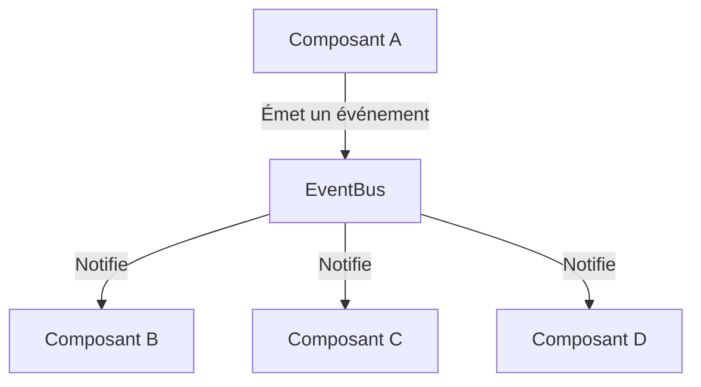
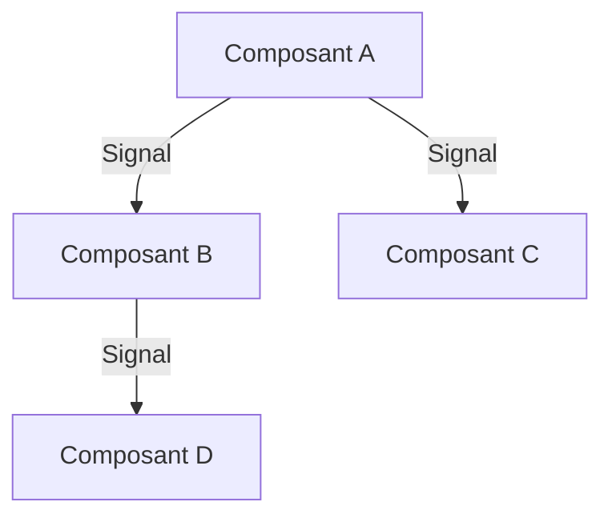
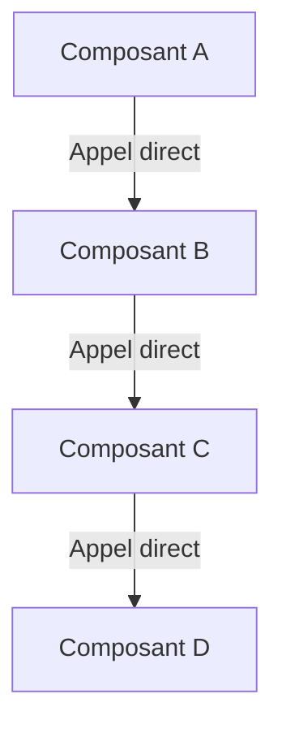

# Comparaison : Bus d'événements vs Signaux/Slots (PySide)

Ce document explique les différences entre l'utilisation d'un bus d'événements personnalisé (comme dans Flet) et les signaux/slots intégrés de PySide.

## 1. Bus d'événements personnalisé (Flet)

### Schéma conceptuel



### Exemple de code

#### Émetteur d'événement

```python
from src.core import emit_event

# Dans un composant ou un service
def on_button_click():
    emit_event("user_action", {"action": "button_clicked", "data": "example"})
```

#### Abonné à l'événement

```python
from src.core import on_event

@on_event("user_action")
def handle_user_action(data):
    print(f"Action reçue : {data['action']}")
```

### Avantages

- **Découplage total** : Les composants n'ont pas besoin de se connaître.
- **Flexibilité** : Peut être utilisé avec n'importe quel framework.
- **Contrôle** : Gestion centralisée des événements et des erreurs.

## 2. Signaux et Slots (PySide)

### Schéma conceptuel



### Exemple de code

#### Émetteur de signal

```python
from PySide6.QtCore import Signal, QObject

class Emetteur(QObject):
    # Déclaration du signal
    user_action = Signal(str, dict)

    def on_button_click(self):
        # Émission du signal
        self.user_action.emit("button_clicked", {"data": "example"})
```

#### Récepteur de signal (Slot)

```python
class Recepteur(QObject):
    def __init__(self, emetteur):
        super().__init__()
        # Connexion du signal au slot
        emetteur.user_action.connect(self.handle_user_action)

    def handle_user_action(self, action, data):
        print(f"Action reçue : {action}")
```

### Avantages

- **Intégré** : Pas besoin d'implémenter un système personnalisé.
- **Optimisé** : Performances élevées grâce à l'intégration native.
- **Typage fort** : Support des types pour les signaux.

## 3. Comparaison

| Critère            | Bus d'événements (Flet)           | Signaux/Slots (PySide)        |
| ------------------ | --------------------------------- | ----------------------------- |
| **Couplage**       | Faible (découplage total)         | Moyen (connexion explicite)   |
| **Flexibilité**    | Élevée (indépendant du framework) | Limitée (spécifique à PySide) |
| **Complexité**     | Moyenne (implémentation requise)  | Faible (intégré)              |
| **Maintenabilité** | Élevée (modularité)               | Moyenne (dépend de PySide)    |
| **Tests**          | Faciles (mocking possible)        | Faciles (intégré à Qt)        |

## 3. Approche sans bus d'événements (avant la refactorisation)

Avant l'introduction du bus d'événements, l'application utilisait des appels directs entre les composants. Voici comment cela fonctionnait :

### Schéma conceptuel



### Exemple de code

#### Appel direct entre composants

```python
class ComposantA:
    def __init__(self, composant_b):
        self.composant_b = composant_b

    def on_action(self):
        # Appel direct à ComposantB
        self.composant_b.handle_action({"data": "example"})

class ComposantB:
    def handle_action(self, data):
        print(f"Action reçue : {data}")
        # Appel direct à ComposantC
        ComposantC().process_data(data)

class ComposantC:
    def process_data(self, data):
        print(f"Traitement des données : {data}")
```

### Inconvénients de cette approche

- **Couplage fort** : Les composants doivent se connaître mutuellement, ce qui rend le code difficile à maintenir et à tester.
- **Difficile à étendre** : Ajouter un nouveau composant nécessite de modifier plusieurs parties du code.
- **Gestion des erreurs complexe** : Les erreurs doivent être gérées individuellement dans chaque composant.
- **Manque de flexibilité** : Impossible de changer dynamiquement les dépendances entre les composants.

## 4. Comparaison

| Critère            | Bus d'événements (Flet)           | Signaux/Slots (PySide)        | Appels directs (avant refactorisation) |
| ------------------ | --------------------------------- | ----------------------------- | -------------------------------------- |
| **Couplage**       | Faible (découplage total)         | Moyen (connexion explicite)   | Fort (dépendances directes)            |
| **Flexibilité**    | Élevée (indépendant du framework) | Limitée (spécifique à PySide) | Faible (dépendances statiques)         |
| **Complexité**     | Moyenne (implémentation requise)  | Faible (intégré)              | Faible (mais difficile à maintenir)    |
| **Maintenabilité** | Élevée (modularité)               | Moyenne (dépend de PySide)    | Faible (couplage fort)                 |
| **Tests**          | Faciles (mocking possible)        | Faciles (intégré à Qt)        | Difficiles (dépendances complexes)     |

## 5. Conclusion

- **Bus d'événements** : Idéal pour les applications nécessitant un découplage fort et une indépendance vis-à-vis du framework UI. Parfait pour Flet ou d'autres frameworks légers.
- **Signaux/Slots** : Idéal pour les applications utilisant PySide/Qt, où la gestion des événements est intégrée et optimisée.
- **Appels directs** : Approche simple mais limitée, adaptée aux petites applications ou aux prototypes. La refactorisation vers un bus d'événements améliore significativement la maintenabilité et la flexibilité.

Les deux approches (bus d'événements et signaux/slots) ont leurs avantages, mais le bus d'événements personnalisé offre une flexibilité et une modularité supérieures, surtout dans des contextes où le framework UI ne propose pas de solution intégrée. La refactorisation en cours est une amélioration majeure par rapport aux appels directs utilisés précédemment.
